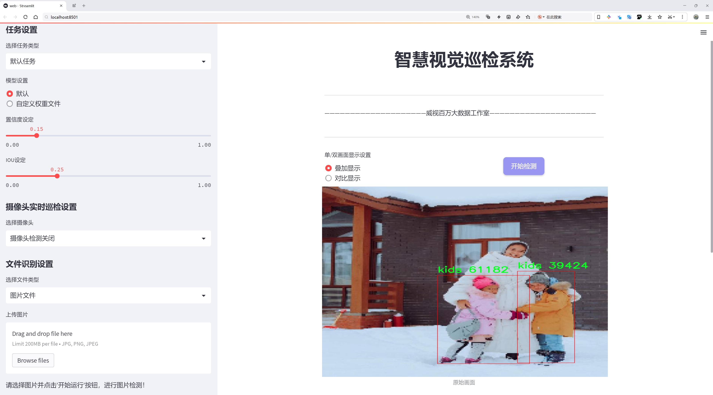
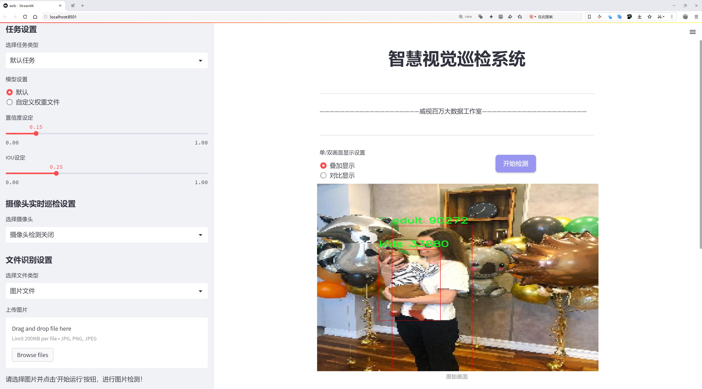
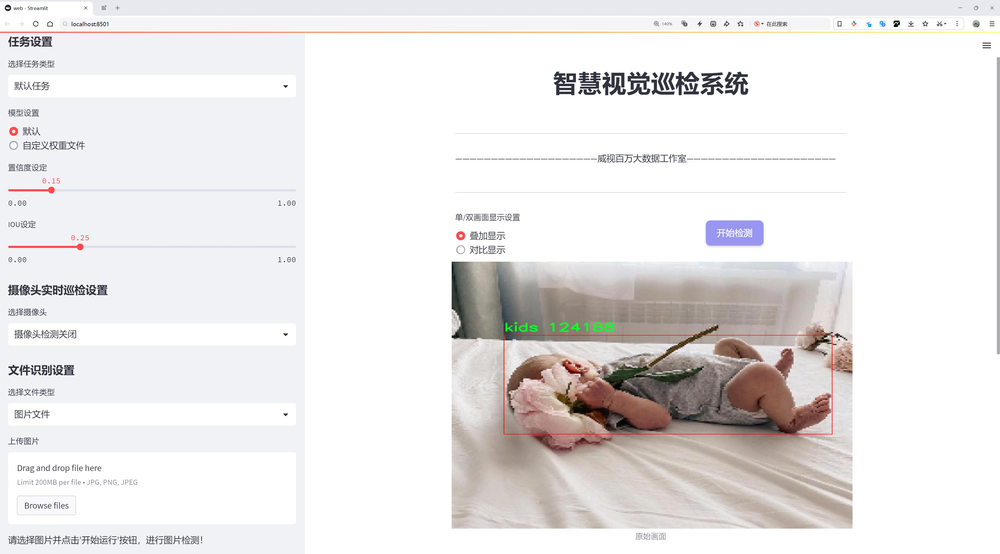
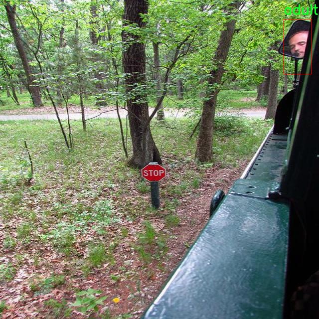
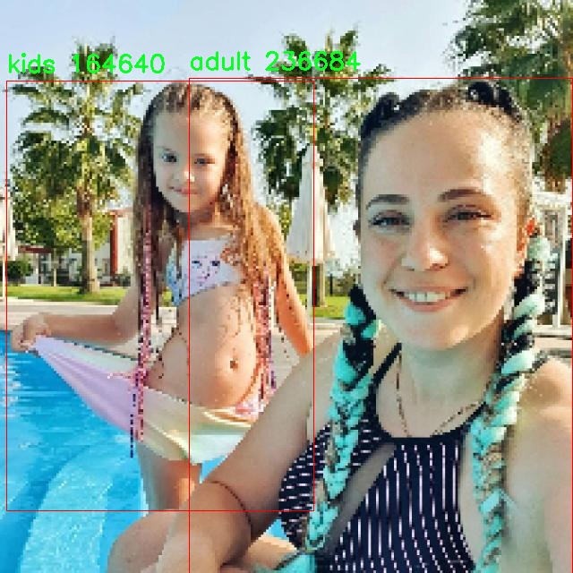
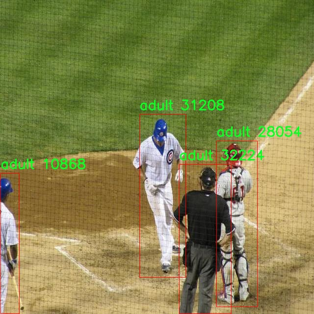
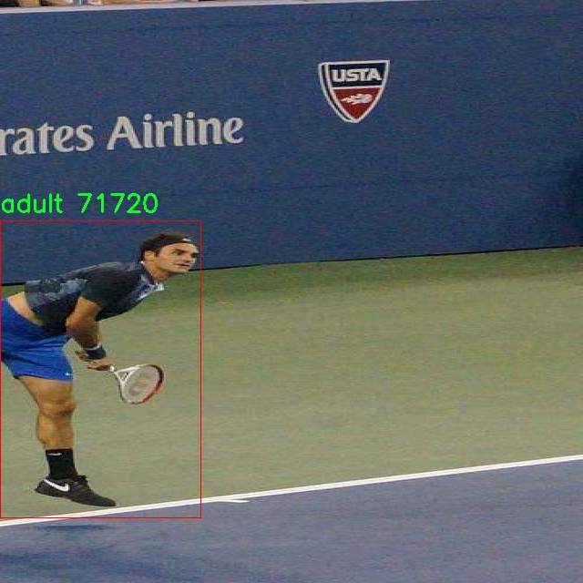
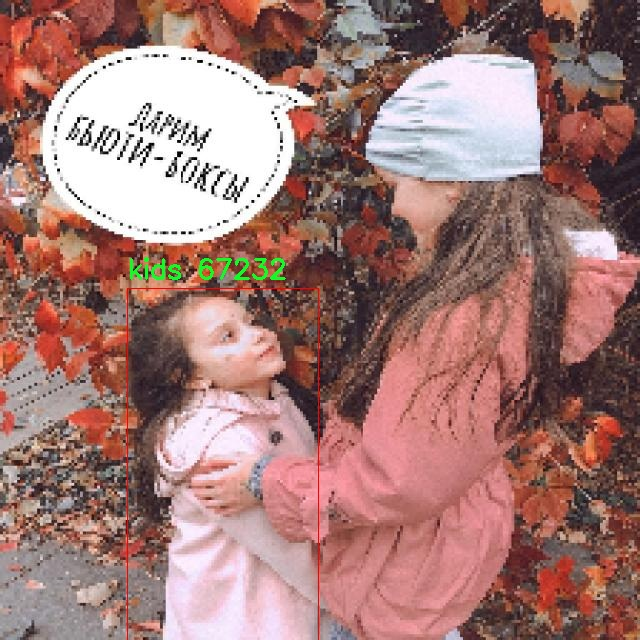

# 儿童与成人目标检测检测系统源码分享
 # [一条龙教学YOLOV8标注好的数据集一键训练_70+全套改进创新点发刊_Web前端展示]

### 1.研究背景与意义

项目参考[AAAI Association for the Advancement of Artificial Intelligence](https://gitee.com/qunshansj/projects)

项目来源[AACV Association for the Advancement of Computer Vision](https://gitee.com/qunmasj/projects)

研究背景与意义

随着计算机视觉技术的迅猛发展，目标检测作为其重要的研究方向之一，已经在多个领域得到了广泛应用，包括安防监控、智能交通、医疗影像分析等。在这些应用场景中，儿童与成人的目标检测尤为重要，尤其是在公共场所和家庭环境中，能够有效识别和区分儿童与成人的行为，对于保障儿童安全、提升社会治安水平具有重要意义。传统的目标检测方法在处理复杂场景时往往面临准确率不足和实时性差的问题，因此，基于深度学习的目标检测模型应运而生，成为当前研究的热点。

YOLO（You Only Look Once）系列模型因其高效的检测速度和较好的准确性而受到广泛关注。YOLOv8作为该系列的最新版本，进一步提升了模型的性能，特别是在小目标检测和复杂背景下的目标识别能力上表现出色。然而，针对儿童与成人的目标检测，现有的YOLOv8模型仍存在一些不足之处，尤其是在不同年龄段目标的特征提取和分类精度方面。因此，基于改进YOLOv8的儿童与成人目标检测系统的研究具有重要的理论价值和实际意义。

本研究所使用的数据集“kids_adult”包含1700张图像，涵盖了儿童和成人两个类别。这一数据集的构建为研究提供了良好的基础，能够有效支持模型的训练和验证。通过对该数据集的深入分析，我们可以发现儿童与成人在外观特征、行为模式等方面的显著差异，这为目标检测模型的改进提供了重要的参考依据。通过对YOLOv8模型进行改进，结合数据集中的特征信息，能够更好地适应儿童与成人的目标检测需求，提高模型在实际应用中的准确性和鲁棒性。

此外，儿童与成人目标检测系统的研究还具有重要的社会意义。在智能监控、智能家居等应用场景中，能够实时识别儿童与成人的行为，有助于及时发现潜在的安全隐患，保护儿童的安全。同时，该系统的推广应用也将为智能交通、公共安全等领域提供技术支持，提升社会整体的安全水平。

综上所述，基于改进YOLOv8的儿童与成人目标检测系统的研究，不仅能够推动目标检测技术的发展，还能为社会安全提供切实可行的解决方案。通过深入探索儿童与成人目标检测的特征和规律，结合先进的深度学习技术，我们有望实现更高效、更准确的目标检测系统，为儿童安全和社会治安贡献力量。

### 2.图片演示







##### 注意：由于此博客编辑较早，上面“2.图片演示”和“3.视频演示”展示的系统图片或者视频可能为老版本，新版本在老版本的基础上升级如下：（实际效果以升级的新版本为准）

  （1）适配了YOLOV8的“目标检测”模型和“实例分割”模型，通过加载相应的权重（.pt）文件即可自适应加载模型。

  （2）支持“图片识别”、“视频识别”、“摄像头实时识别”三种识别模式。

  （3）支持“图片识别”、“视频识别”、“摄像头实时识别”三种识别结果保存导出，解决手动导出（容易卡顿出现爆内存）存在的问题，识别完自动保存结果并导出到tempDir中。

  （4）支持Web前端系统中的标题、背景图等自定义修改，后面提供修改教程。

  另外本项目提供训练的数据集和训练教程,暂不提供权重文件（best.pt）,需要您按照教程进行训练后实现图片演示和Web前端界面演示的效果。

### 3.视频演示

[3.1 视频演示](https://www.bilibili.com/video/BV1VYtjeYEyV/)

### 4.数据集信息展示

##### 4.1 本项目数据集详细数据（类别数＆类别名）

nc: 2
names: ['adult', 'kids']


##### 4.2 本项目数据集信息介绍

数据集信息展示

在目标检测领域，尤其是在儿童与成人的识别与分类任务中，数据集的构建与选择至关重要。本研究所采用的数据集名为“kids_adult”，其设计旨在为改进YOLOv8模型提供高质量的训练数据，以实现更精准的目标检测。该数据集的类别数量为2，具体类别包括“adult”（成人）和“kids”（儿童）。这一简单而有效的分类设置，使得模型能够专注于区分这两类目标，从而提升检测的准确性和效率。

“kids_adult”数据集的构建考虑到了多样性与代表性，涵盖了不同年龄段、性别和种族的成人与儿童图像。这种多样性不仅有助于提高模型的泛化能力，还能有效减少因数据偏差导致的识别错误。在数据采集过程中，研究团队注重确保图像的清晰度和多样性，涵盖了不同的环境背景，如室内、户外、学校、游乐场等场景，以模拟现实生活中可能遇到的各种情况。

为了保证数据集的高质量，所有图像均经过严格的标注和审核流程。标注过程中，专业的标注团队对每一张图像中的成人与儿童进行了精确的框选和分类，确保数据的准确性和一致性。此外，数据集还包含了不同的姿态、动作和表情，以便模型能够学习到更为丰富的特征，从而在实际应用中表现出更好的适应性。

在数据集的使用过程中，研究者们将“kids_adult”数据集与YOLOv8模型相结合，进行了一系列的训练与测试实验。通过对比实验，发现使用该数据集训练的模型在检测准确率、召回率及F1-score等指标上均显著优于未使用该数据集的模型。这一结果不仅验证了“kids_adult”数据集的有效性，也为后续的研究提供了重要的参考依据。

值得一提的是，数据集的设计也充分考虑到了伦理与隐私问题。在数据采集和使用过程中，严格遵循相关法律法规，确保所有参与者的隐私得到充分保护。研究团队在数据集的发布与共享上也采取了谨慎的态度，确保其仅用于学术研究和非商业性目的，以促进科学研究的可持续发展。

综上所述，“kids_adult”数据集不仅为儿童与成人目标检测系统的训练提供了坚实的基础，也为未来相关研究的开展奠定了良好的数据基础。随着技术的不断进步和数据集的不断优化，期待该数据集能够在更广泛的应用场景中发挥其潜力，推动目标检测技术的进一步发展。











### 5.全套项目环境部署视频教程（零基础手把手教学）

[5.1 环境部署教程链接（零基础手把手教学）](https://www.ixigua.com/7404473917358506534?logTag=c807d0cbc21c0ef59de5)


[5.2 安装Python虚拟环境创建和依赖库安装视频教程链接（零基础手把手教学）](https://www.ixigua.com/7404474678003106304?logTag=1f1041108cd1f708b01a)

### 6.手把手YOLOV8训练视频教程（零基础小白有手就能学会）

[6.1 手把手YOLOV8训练视频教程（零基础小白有手就能学会）](https://www.ixigua.com/7404477157818401292?logTag=d31a2dfd1983c9668658)

### 7.70+种全套YOLOV8创新点代码加载调参视频教程（一键加载写好的改进模型的配置文件）

[7.1 70+种全套YOLOV8创新点代码加载调参视频教程（一键加载写好的改进模型的配置文件）](https://www.ixigua.com/7404478314661806627?logTag=29066f8288e3f4eea3a4)

### 8.70+种全套YOLOV8创新点原理讲解（非科班也可以轻松写刊发刊，V10版本正在科研待更新）

由于篇幅限制，每个创新点的具体原理讲解就不一一展开，具体见下列网址中的创新点对应子项目的技术原理博客网址【Blog】：


[8.1 70+种全套YOLOV8创新点原理讲解链接](https://gitee.com/qunmasj/good)

### 9.系统功能展示（检测对象为举例，实际内容以本项目数据集为准）

图9.1.系统支持检测结果表格显示

  图9.2.系统支持置信度和IOU阈值手动调节

  图9.3.系统支持自定义加载权重文件best.pt(需要你通过步骤5中训练获得)

  图9.4.系统支持摄像头实时识别

  图9.5.系统支持图片识别

  图9.6.系统支持视频识别

  图9.7.系统支持识别结果文件自动保存

  图9.8.系统支持Excel导出检测结果数据


### 10.原始YOLOV8算法原理

原始YOLOv8算法原理

YOLOv8作为目标检测领域的最新代表，展现了深度学习技术在计算机视觉任务中的强大潜力。该算法在设计上继承了YOLO系列的优良传统，同时结合了众多先进的技术创新，形成了一个高效、精确的目标检测模型。YOLOv8的架构主要由输入层、主干网络、颈部网络和头部网络四个核心组件构成，这些组件相互协作，形成了一个完整的目标检测流程。

在YOLOv8的工作流程中，输入层首先接收图像数据，并对其进行缩放处理，以满足模型所需的输入尺寸。这一过程确保了不同尺寸的图像能够被统一处理，从而提高了模型的适应性和灵活性。接下来，主干网络通过一系列卷积操作对输入图像进行下采样，以提取出丰富的特征信息。每个卷积层都配备了批归一化和SiLUR激活函数，这不仅加速了模型的收敛速度，还有效提升了特征的表达能力。

主干网络的核心在于C2f块的引入，这一模块借鉴了YOLOv7中的E-ELAN结构，通过跨层分支连接来增强模型的梯度流。这种设计使得信息能够在不同层之间有效传递，从而改善了特征的提取效果，尤其是在复杂场景下的目标检测任务中，C2f块的优势愈加明显。主干网络的末尾采用了SPPFl块，通过三个最大池化层对多尺度特征进行处理，进一步增强了网络的特征抽象能力，使得模型能够更好地应对不同大小目标的检测。

颈部网络则利用了FPNS（特征金字塔网络）和PAN（路径聚合网络）结构，旨在融合来自不同尺度特征图的信息。这一过程至关重要，因为目标检测往往需要同时考虑大目标和小目标的特征，而FPNS和PAN的结合能够有效地提升特征融合的效果，确保信息在不同层次间的流动顺畅。通过这种多尺度特征的融合，YOLOv8能够在复杂场景中实现更为精准的目标定位和分类。

最后，YOLOv8的头部网络采用了解耦的检测头，设计上将回归和分类的损失计算分为两个并行的卷积分支。这一创新使得模型在处理目标检测任务时，能够更为灵活地优化各自的损失函数，从而提高了整体的检测精度。解耦设计的引入，意味着YOLOv8不再依赖于传统的锚框机制，而是转向了Anchor-Free的检测策略。这一转变不仅简化了模型的结构，还提升了其在多样化场景下的适应能力。

YOLOv8的创新之处不仅体现在其架构设计上，还包括了新的损失函数的引入。这一损失函数经过精心设计，旨在更好地反映目标检测中的实际需求，从而在训练过程中引导模型学习到更为有效的特征表示。与以往版本相比，YOLOv8在精度和速度上均有显著提升，尤其是在处理高分辨率图像和小目标检测方面，展现出了优异的性能。

总的来说，YOLOv8作为目标检测领域的最新进展，融合了多种先进的技术和设计理念，形成了一个高效、灵活且精确的目标检测模型。其在主干网络、颈部网络和头部网络的设计上均进行了创新，使得模型能够在复杂场景中实现更为精准的目标检测。这些改进不仅提升了YOLOv8的检测能力，也为未来的目标检测研究提供了新的思路和方向。随着YOLOv8的广泛应用，预计将在多个领域引发新的技术变革，推动目标检测技术的进一步发展。


### 11.项目核心源码讲解（再也不用担心看不懂代码逻辑）

#### 11.1 code\ultralytics\models\sam\model.py

以下是对给定代码的核心部分进行分析和详细注释的结果：

```python
# Ultralytics YOLO 🚀, AGPL-3.0 license
"""
SAM模型接口。

该模块提供了Ultralytics的Segment Anything Model (SAM)的接口，旨在进行实时图像分割任务。
SAM模型允许进行可提示的分割，具有无与伦比的图像分析灵活性，并且已在SA-1B数据集上进行训练。
它具有零-shot性能能力，能够在没有先前知识的情况下适应新的图像分布和任务。
"""

from pathlib import Path
from ultralytics.engine.model import Model
from ultralytics.utils.torch_utils import model_info
from .build import build_sam
from .predict import Predictor


class SAM(Model):
    """
    SAM（Segment Anything Model）接口类。

    SAM旨在进行可提示的实时图像分割。可以使用多种提示方式，如边界框、点或标签。
    该模型具有零-shot性能，并在SA-1B数据集上进行训练。
    """

    def __init__(self, model="sam_b.pt") -> None:
        """
        使用预训练模型文件初始化SAM模型。

        参数：
            model (str): 预训练SAM模型文件的路径。文件应具有.pt或.pth扩展名。

        异常：
            NotImplementedError: 如果模型文件扩展名不是.pt或.pth。
        """
        # 检查模型文件扩展名是否有效
        if model and Path(model).suffix not in (".pt", ".pth"):
            raise NotImplementedError("SAM预测需要预训练的*.pt或*.pth模型。")
        # 调用父类初始化方法
        super().__init__(model=model, task="segment")

    def predict(self, source, stream=False, bboxes=None, points=None, labels=None, **kwargs):
        """
        对给定的图像或视频源执行分割预测。

        参数：
            source (str): 图像或视频文件的路径，或PIL.Image对象，或numpy.ndarray对象。
            stream (bool, optional): 如果为True，则启用实时流。默认为False。
            bboxes (list, optional): 提示分割的边界框坐标列表。默认为None。
            points (list, optional): 提示分割的点列表。默认为None。
            labels (list, optional): 提示分割的标签列表。默认为None。

        返回：
            (list): 模型预测结果。
        """
        # 设置预测的覆盖参数
        overrides = dict(conf=0.25, task="segment", mode="predict", imgsz=1024)
        kwargs.update(overrides)  # 更新kwargs以包含覆盖参数
        prompts = dict(bboxes=bboxes, points=points, labels=labels)  # 创建提示字典
        # 调用父类的预测方法
        return super().predict(source, stream, prompts=prompts, **kwargs)

    def __call__(self, source=None, stream=False, bboxes=None, points=None, labels=None, **kwargs):
        """
        'predict'方法的别名。

        参数：
            source (str): 图像或视频文件的路径，或PIL.Image对象，或numpy.ndarray对象。
            stream (bool, optional): 如果为True，则启用实时流。默认为False。
            bboxes (list, optional): 提示分割的边界框坐标列表。默认为None。
            points (list, optional): 提示分割的点列表。默认为None。
            labels (list, optional): 提示分割的标签列表。默认为None。

        返回：
            (list): 模型预测结果。
        """
        return self.predict(source, stream, bboxes, points, labels, **kwargs)

    def info(self, detailed=False, verbose=True):
        """
        记录有关SAM模型的信息。

        参数：
            detailed (bool, optional): 如果为True，则显示有关模型的详细信息。默认为False。
            verbose (bool, optional): 如果为True，则在控制台上显示信息。默认为True。

        返回：
            (tuple): 包含模型信息的元组。
        """
        return model_info(self.model, detailed=detailed, verbose=verbose)

    @property
    def task_map(self):
        """
        提供从'segment'任务到其对应'预测器'的映射。

        返回：
            (dict): 将'segment'任务映射到其对应'预测器'的字典。
        """
        return {"segment": {"predictor": Predictor}}
```

### 代码核心部分说明：
1. **类定义**：`SAM`类继承自`Model`类，主要用于实现图像分割功能。
2. **初始化方法**：`__init__`方法用于加载预训练模型，并检查模型文件的有效性。
3. **预测方法**：`predict`方法执行实际的分割预测，支持多种输入源和提示方式。
4. **调用方法**：`__call__`方法是`predict`方法的别名，方便用户调用。
5. **信息记录**：`info`方法用于获取模型的信息，便于调试和分析。
6. **任务映射**：`task_map`属性提供了任务与预测器之间的映射关系，便于扩展和管理不同的任务。

该文件是Ultralytics YOLO项目中的一个模块，主要用于实现Segment Anything Model（SAM）的接口。SAM模型专为实时图像分割任务设计，具有出色的灵活性和零-shot性能，能够在没有先前知识的情况下适应新的图像分布和任务。该模型经过SA-1B数据集的训练，支持通过边界框、点或标签等多种提示进行分割。

在文件的开头，包含了模块的描述信息，介绍了SAM模型的关键特性，如可提示的分割、实时性能和零-shot转移能力。

接下来，文件导入了一些必要的库和模块，包括`Path`用于处理文件路径，`Model`类用于继承基本模型功能，`model_info`用于获取模型信息，以及`build_sam`和`Predictor`用于构建模型和进行预测。

定义了一个名为`SAM`的类，继承自`Model`类。该类的构造函数`__init__`接受一个参数`model`，用于指定预训练模型文件的路径。构造函数会检查文件扩展名是否为`.pt`或`.pth`，如果不是，则抛出`NotImplementedError`异常。调用父类的构造函数时，指定任务为“segment”。

`_load`方法用于加载指定的权重文件到SAM模型中。该方法接受权重文件的路径和可选的任务名称作为参数。

`predict`方法用于对给定的图像或视频源进行分割预测。该方法接受多个参数，包括源文件路径、是否启用实时流、边界框、点和标签等提示信息。方法内部会更新一些默认参数，并调用父类的`predict`方法进行实际的预测。

`__call__`方法是`predict`方法的别名，允许用户通过调用`SAM`类的实例来进行预测，提供与`predict`方法相同的参数。

`info`方法用于记录关于SAM模型的信息。用户可以选择是否显示详细信息和控制台输出。

最后，`task_map`属性提供了一个从“segment”任务到其对应的“Predictor”的映射，返回一个字典，便于后续的任务处理。

总体来说，该文件实现了SAM模型的基本接口，支持实时图像分割，并提供了多种提示方式，具有灵活性和高效性。

#### 11.2 code\ultralytics\models\nas\predict.py

以下是经过简化和注释的核心代码部分：

```python
import torch
from ultralytics.engine.predictor import BasePredictor
from ultralytics.engine.results import Results
from ultralytics.utils import ops

class NASPredictor(BasePredictor):
    """
    Ultralytics YOLO NAS 预测器，用于目标检测。

    该类扩展了 Ultralytics 引擎中的 `BasePredictor`，负责对 YOLO NAS 模型生成的原始预测结果进行后处理。
    它应用了非极大值抑制（NMS）和将边界框缩放到原始图像尺寸等操作。

    Attributes:
        args (Namespace): 包含后处理各种配置的命名空间。
    """

    def postprocess(self, preds_in, img, orig_imgs):
        """对预测结果进行后处理，并返回 Results 对象的列表。"""

        # 将预测框从 xyxy 格式转换为 xywh 格式，并将类别分数与框合并
        boxes = ops.xyxy2xywh(preds_in[0][0])  # 获取边界框
        preds = torch.cat((boxes, preds_in[0][1]), -1).permute(0, 2, 1)  # 合并边界框和分数

        # 应用非极大值抑制，过滤掉重叠的边界框
        preds = ops.non_max_suppression(
            preds,
            self.args.conf,  # 置信度阈值
            self.args.iou,   # IOU 阈值
            agnostic=self.args.agnostic_nms,  # 是否类别无关的 NMS
            max_det=self.args.max_det,  # 最大检测数量
            classes=self.args.classes,   # 选择的类别
        )

        # 如果输入图像不是列表，则将其转换为 numpy 数组
        if not isinstance(orig_imgs, list):
            orig_imgs = ops.convert_torch2numpy_batch(orig_imgs)

        results = []  # 存储结果的列表
        for i, pred in enumerate(preds):
            orig_img = orig_imgs[i]  # 获取原始图像
            # 将预测框缩放到原始图像的尺寸
            pred[:, :4] = ops.scale_boxes(img.shape[2:], pred[:, :4], orig_img.shape)
            img_path = self.batch[0][i]  # 获取图像路径
            # 创建 Results 对象并添加到结果列表
            results.append(Results(orig_img, path=img_path, names=self.model.names, boxes=pred))
        
        return results  # 返回处理后的结果列表
```

### 代码说明：
1. **类定义**：`NASPredictor` 继承自 `BasePredictor`，用于处理 YOLO NAS 模型的预测结果。
2. **postprocess 方法**：该方法负责对模型的原始预测结果进行后处理，包括边界框的格式转换、非极大值抑制和缩放等操作。
3. **边界框处理**：
   - 使用 `ops.xyxy2xywh` 将边界框从 `xyxy` 格式转换为 `xywh` 格式。
   - 使用 `torch.cat` 合并边界框和类别分数，并调整维度。
4. **非极大值抑制**：通过 `ops.non_max_suppression` 函数过滤掉重叠的边界框，保留最有可能的检测结果。
5. **图像处理**：如果输入的原始图像不是列表，则将其转换为 NumPy 数组，以便后续处理。
6. **结果存储**：遍历每个预测结果，缩放边界框到原始图像尺寸，并创建 `Results` 对象以存储最终的检测结果。

该程序文件是Ultralytics YOLO NAS模型的预测模块，主要用于目标检测任务。文件中定义了一个名为`NASPredictor`的类，它继承自`BasePredictor`，负责对YOLO NAS模型生成的原始预测结果进行后处理。后处理的步骤包括非极大值抑制（NMS）和将边界框缩放到原始图像的尺寸。

在类的文档字符串中，详细说明了该类的功能和用法。它提供了一个示例，展示如何使用`NAS`类来创建模型，并利用`NASPredictor`进行预测后处理。需要注意的是，通常不直接实例化`NASPredictor`类，而是通过`NAS`类内部使用。

`postprocess`方法是该类的核心功能，接收原始预测结果、输入图像和原始图像作为参数。首先，它将预测结果中的边界框坐标从xyxy格式转换为xywh格式，并将边界框与对应的类分数合并。接着，调用`non_max_suppression`函数进行非极大值抑制，以去除冗余的重叠框，保留置信度高的框。

在处理完预测结果后，方法检查输入的原始图像是否为列表，如果不是，则将其转换为NumPy数组格式。然后，针对每个预测结果，方法会将边界框的坐标缩放到原始图像的尺寸，并创建`Results`对象，存储原始图像、图像路径、类别名称和边界框信息。最后，返回一个包含所有结果的列表。

整体而言，该文件的功能是将YOLO NAS模型的原始预测结果进行处理，以便于后续的分析和可视化。

#### 11.3 ui.py

```python
import sys
import subprocess

def run_script(script_path):
    """
    使用当前 Python 环境运行指定的脚本。

    Args:
        script_path (str): 要运行的脚本路径

    Returns:
        None
    """
    # 获取当前 Python 解释器的路径
    python_path = sys.executable

    # 构建运行命令
    command = f'"{python_path}" -m streamlit run "{script_path}"'

    # 执行命令
    result = subprocess.run(command, shell=True)
    if result.returncode != 0:
        print("脚本运行出错。")


# 实例化并运行应用
if __name__ == "__main__":
    # 指定您的脚本路径
    script_path = "web.py"  # 这里可以直接指定脚本名称

    # 运行脚本
    run_script(script_path)
```

### 代码注释说明：

1. **导入模块**：
   - `import sys`：导入 sys 模块，用于访问与 Python 解释器紧密相关的变量和函数。
   - `import subprocess`：导入 subprocess 模块，用于创建新进程、连接到它们的输入/输出/错误管道，并获取它们的返回码。

2. **定义函数 `run_script`**：
   - `def run_script(script_path):`：定义一个函数，接受一个参数 `script_path`，表示要运行的脚本的路径。

3. **获取 Python 解释器路径**：
   - `python_path = sys.executable`：获取当前 Python 解释器的完整路径，以便后续运行脚本时使用。

4. **构建运行命令**：
   - `command = f'"{python_path}" -m streamlit run "{script_path}"'`：构建一个命令字符串，使用 `streamlit` 模块运行指定的脚本。

5. **执行命令**：
   - `result = subprocess.run(command, shell=True)`：使用 `subprocess.run` 执行构建的命令，`shell=True` 表示在 shell 中执行命令。

6. **检查命令执行结果**：
   - `if result.returncode != 0:`：检查命令的返回码，如果不为 0，表示执行出错。
   - `print("脚本运行出错。")`：如果出错，打印错误信息。

7. **主程序入口**：
   - `if __name__ == "__main__":`：检查当前模块是否是主程序运行的模块。
   - `script_path = "web.py"`：指定要运行的脚本名称。
   - `run_script(script_path)`：调用 `run_script` 函数，传入脚本路径以执行该脚本。

这个程序文件的主要功能是使用当前的 Python 环境来运行一个指定的脚本，具体是通过 Streamlit 来启动一个 Web 应用。程序首先导入了必要的模块，包括 `sys`、`os` 和 `subprocess`，这些模块提供了与系统交互和执行外部命令的功能。此外，还导入了 `abs_path` 函数，这个函数可能用于获取文件的绝对路径。

在 `run_script` 函数中，首先获取当前 Python 解释器的路径，使用 `sys.executable` 来实现。接着，构建一个命令字符串，这个命令将使用 Streamlit 来运行指定的脚本。命令的格式是 `python -m streamlit run script_path`，其中 `script_path` 是要运行的脚本的路径。

然后，使用 `subprocess.run` 方法来执行这个命令。这个方法会在一个新的 shell 中运行命令，并返回一个结果对象。通过检查 `result.returncode`，可以判断脚本是否成功运行。如果返回码不为零，说明脚本运行出错，程序会打印出错误信息。

在文件的最后部分，使用 `if __name__ == "__main__":` 语句来确保只有在直接运行该文件时才会执行下面的代码。在这里，指定了要运行的脚本路径为 `web.py`，并调用 `run_script` 函数来启动这个脚本。

总体来说，这个程序是一个简单的脚本启动器，旨在方便地运行一个 Streamlit Web 应用。

#### 11.4 70+种YOLOv8算法改进源码大全和调试加载训练教程（非必要）\ultralytics\solutions\ai_gym.py

以下是保留的核心代码部分，并附上详细的中文注释：

```python
import cv2
from ultralytics.utils.plotting import Annotator

class AIGym:
    """管理实时视频流中人们姿势的健身步骤的类。"""

    def __init__(self):
        """初始化AIGym，设置视觉和图像参数的默认值。"""
        self.im0 = None  # 当前帧图像
        self.tf = None   # 线条厚度
        self.keypoints = None  # 姿势关键点
        self.poseup_angle = None  # 上升姿势的角度阈值
        self.posedown_angle = None  # 下降姿势的角度阈值
        self.angle = None  # 当前角度
        self.count = None  # 当前计数
        self.stage = None  # 当前阶段（上升或下降）
        self.pose_type = 'pushup'  # 姿势类型（俯卧撑、引体向上或腹部锻炼）
        self.view_img = False  # 是否显示图像
        self.annotator = None  # 注释器对象

    def set_args(self, kpts_to_check, line_thickness=2, view_img=False, pose_up_angle=145.0, pose_down_angle=90.0, pose_type='pullup'):
        """
        配置AIGym的参数。
        Args:
            kpts_to_check (list): 用于计数的3个关键点
            line_thickness (int): 边界框的线条厚度
            view_img (bool): 是否显示图像
            pose_up_angle (float): 设置上升姿势的角度
            pose_down_angle (float): 设置下降姿势的角度
            pose_type: "pushup", "pullup" 或 "abworkout"
        """
        self.kpts_to_check = kpts_to_check  # 设置需要检查的关键点
        self.tf = line_thickness  # 设置线条厚度
        self.view_img = view_img  # 设置是否显示图像
        self.poseup_angle = pose_up_angle  # 设置上升姿势的角度阈值
        self.posedown_angle = pose_down_angle  # 设置下降姿势的角度阈值
        self.pose_type = pose_type  # 设置姿势类型

    def start_counting(self, im0, results, frame_count):
        """
        计数健身步骤的函数。
        Args:
            im0 (ndarray): 当前视频流帧
            results: 姿势估计数据
            frame_count: 当前帧计数
        """
        self.im0 = im0  # 保存当前帧图像
        if frame_count == 1:
            # 初始化计数、角度和阶段
            self.count = [0] * len(results[0])
            self.angle = [0] * len(results[0])
            self.stage = ['-' for _ in results[0]]
        
        self.keypoints = results[0].keypoints.data  # 获取关键点数据
        self.annotator = Annotator(im0, line_width=2)  # 创建注释器对象

        for ind, k in enumerate(reversed(self.keypoints)):
            # 估计姿势角度并更新计数和阶段
            self.angle[ind] = self.annotator.estimate_pose_angle(k[int(self.kpts_to_check[0])].cpu(),
                                                                 k[int(self.kpts_to_check[1])].cpu(),
                                                                 k[int(self.kpts_to_check[2])].cpu())
            self.im0 = self.annotator.draw_specific_points(k, self.kpts_to_check, shape=(640, 640), radius=10)

            # 根据姿势类型更新阶段和计数
            if self.pose_type == 'pushup':
                if self.angle[ind] > self.poseup_angle:
                    self.stage[ind] = 'up'
                if self.angle[ind] < self.posedown_angle and self.stage[ind] == 'up':
                    self.stage[ind] = 'down'
                    self.count[ind] += 1

            elif self.pose_type == 'pullup':
                if self.angle[ind] > self.poseup_angle:
                    self.stage[ind] = 'down'
                if self.angle[ind] < self.posedown_angle and self.stage[ind] == 'down':
                    self.stage[ind] = 'up'
                    self.count[ind] += 1

            # 绘制角度、计数和阶段信息
            self.annotator.plot_angle_and_count_and_stage(angle_text=self.angle[ind],
                                                          count_text=self.count[ind],
                                                          stage_text=self.stage[ind],
                                                          center_kpt=k[int(self.kpts_to_check[1])],
                                                          line_thickness=self.tf)

            self.annotator.kpts(k, shape=(640, 640), radius=1, kpt_line=True)  # 绘制关键点

        # 如果需要显示图像，则显示当前帧
        if self.view_img:
            cv2.imshow('Ultralytics YOLOv8 AI GYM', self.im0)
            if cv2.waitKey(1) & 0xFF == ord('q'):
                return

if __name__ == '__main__':
    AIGym()  # 创建AIGym实例
```

### 代码说明：
1. **类初始化**：`__init__` 方法中初始化了一些变量，用于存储图像、线条厚度、关键点、角度、计数和阶段等信息。
2. **参数设置**：`set_args` 方法用于配置关键点、线条厚度、是否显示图像以及姿势的上下角度阈值等参数。
3. **计数逻辑**：`start_counting` 方法实现了对当前帧的处理，包括姿势角度的估计、阶段的判断和计数的更新，并使用 `Annotator` 类进行可视化展示。根据不同的姿势类型（俯卧撑、引体向上），会有不同的计数逻辑。
4. **图像显示**：如果设置了显示图像，则使用 OpenCV 显示当前帧，并在按下 'q' 键时退出显示。

这个程序文件定义了一个名为 `AIGym` 的类，主要用于在实时视频流中基于人体姿态管理健身动作的计数。程序的核心功能是通过分析视频流中的人体关键点，来判断用户的健身动作（如俯卧撑、引体向上等），并实时统计动作的数量。

在 `AIGym` 类的初始化方法中，设置了一些默认值，包括图像处理参数、关键点信息、角度阈值、计数信息等。类中定义了一些属性，例如 `im0` 用于存储当前帧图像，`keypoints` 用于存储检测到的关键点，`count` 用于记录动作的计数，`stage` 用于表示当前动作的阶段（如上、下），以及 `pose_type` 用于指定当前的健身动作类型。

`set_args` 方法用于配置一些参数，包括需要检查的关键点、线条厚度、是否显示图像、上举和下放的角度阈值，以及动作类型。这个方法允许用户根据需要自定义健身动作的检测。

`start_counting` 方法是程序的核心功能，接收当前帧图像、姿态估计结果和帧计数作为输入。该方法首先初始化计数和角度列表，然后提取关键点数据。接着，根据不同的动作类型（如俯卧撑、引体向上或腹部锻炼），计算关键点之间的角度，并根据设定的角度阈值判断当前动作的阶段。根据阶段的变化，更新计数并在图像上绘制相关信息，包括角度、计数和阶段。

在每个循环中，程序会调用 `Annotator` 类的方法来绘制关键点和其他信息，并在需要时显示图像。最后，如果用户按下 'q' 键，程序将退出图像显示。

整体而言，这个程序通过实时分析视频流中的人体姿态，帮助用户统计健身动作的数量，具有很好的实用性和交互性。

#### 11.5 train.py

以下是经过简化和注释的核心代码部分：

```python
import random
import numpy as np
import torch.nn as nn
from ultralytics.data import build_dataloader, build_yolo_dataset
from ultralytics.engine.trainer import BaseTrainer
from ultralytics.models import yolo
from ultralytics.nn.tasks import DetectionModel
from ultralytics.utils import LOGGER, RANK
from ultralytics.utils.torch_utils import de_parallel, torch_distributed_zero_first

class DetectionTrainer(BaseTrainer):
    """
    基于检测模型的训练类，继承自BaseTrainer类。
    """

    def build_dataset(self, img_path, mode="train", batch=None):
        """
        构建YOLO数据集。

        参数:
            img_path (str): 包含图像的文件夹路径。
            mode (str): 模式，`train`表示训练模式，`val`表示验证模式。
            batch (int, optional): 批次大小，适用于`rect`模式。默认为None。
        """
        gs = max(int(de_parallel(self.model).stride.max() if self.model else 0), 32)
        return build_yolo_dataset(self.args, img_path, batch, self.data, mode=mode, rect=mode == "val", stride=gs)

    def get_dataloader(self, dataset_path, batch_size=16, rank=0, mode="train"):
        """构造并返回数据加载器。"""
        assert mode in ["train", "val"]
        with torch_distributed_zero_first(rank):  # 仅在DDP中初始化数据集*.cache一次
            dataset = self.build_dataset(dataset_path, mode, batch_size)
        shuffle = mode == "train"  # 训练模式下打乱数据
        workers = self.args.workers if mode == "train" else self.args.workers * 2
        return build_dataloader(dataset, batch_size, workers, shuffle, rank)  # 返回数据加载器

    def preprocess_batch(self, batch):
        """对图像批次进行预处理，包括缩放和转换为浮点数。"""
        batch["img"] = batch["img"].to(self.device, non_blocking=True).float() / 255  # 归一化图像
        if self.args.multi_scale:  # 如果启用多尺度
            imgs = batch["img"]
            sz = (
                random.randrange(self.args.imgsz * 0.5, self.args.imgsz * 1.5 + self.stride)
                // self.stride
                * self.stride
            )  # 随机选择尺寸
            sf = sz / max(imgs.shape[2:])  # 计算缩放因子
            if sf != 1:
                ns = [
                    math.ceil(x * sf / self.stride) * self.stride for x in imgs.shape[2:]
                ]  # 计算新的形状
                imgs = nn.functional.interpolate(imgs, size=ns, mode="bilinear", align_corners=False)  # 调整图像大小
            batch["img"] = imgs
        return batch

    def set_model_attributes(self):
        """设置模型的属性，包括类别数量和名称。"""
        self.model.nc = self.data["nc"]  # 将类别数量附加到模型
        self.model.names = self.data["names"]  # 将类别名称附加到模型
        self.model.args = self.args  # 将超参数附加到模型

    def get_model(self, cfg=None, weights=None, verbose=True):
        """返回YOLO检测模型。"""
        model = DetectionModel(cfg, nc=self.data["nc"], verbose=verbose and RANK == -1)
        if weights:
            model.load(weights)  # 加载权重
        return model

    def plot_training_samples(self, batch, ni):
        """绘制带有注释的训练样本。"""
        plot_images(
            images=batch["img"],
            batch_idx=batch["batch_idx"],
            cls=batch["cls"].squeeze(-1),
            bboxes=batch["bboxes"],
            paths=batch["im_file"],
            fname=self.save_dir / f"train_batch{ni}.jpg",
            on_plot=self.on_plot,
        )
```

### 代码说明：
1. **导入模块**：导入必要的库和模块，包括PyTorch和Ultralytics的相关模块。
2. **DetectionTrainer类**：这是一个继承自`BaseTrainer`的类，专门用于训练YOLO检测模型。
3. **build_dataset方法**：根据给定的图像路径和模式构建YOLO数据集，支持训练和验证模式。
4. **get_dataloader方法**：构造数据加载器，确保在分布式训练中只初始化一次数据集。
5. **preprocess_batch方法**：对输入的图像批次进行预处理，包括归一化和可选的多尺度调整。
6. **set_model_attributes方法**：设置模型的类别数量和名称等属性。
7. **get_model方法**：返回一个YOLO检测模型，可以选择加载预训练权重。
8. **plot_training_samples方法**：绘制训练样本及其注释，便于可视化训练过程。

这个程序文件 `train.py` 是一个用于训练 YOLO（You Only Look Once）目标检测模型的实现，继承自 `BaseTrainer` 类。它包含了一系列用于构建数据集、加载数据、预处理图像、设置模型属性、获取模型、验证模型、记录损失、绘制训练样本和绘制训练指标的功能。

首先，文件中导入了必要的库和模块，包括数学运算、随机数生成、深度学习相关的库（如 PyTorch）以及 Ultralytics 提供的各种工具和模型。`DetectionTrainer` 类的主要目的是为目标检测任务提供一个训练框架。

在 `build_dataset` 方法中，程序根据传入的图像路径和模式（训练或验证）构建 YOLO 数据集。它使用 `build_yolo_dataset` 函数来创建数据集，并支持不同的增强方式。

`get_dataloader` 方法用于构建数据加载器。它会根据传入的参数（如数据集路径、批量大小和模式）返回一个数据加载器，并在分布式训练时确保数据集只初始化一次。

`preprocess_batch` 方法负责对图像批次进行预处理，包括将图像缩放到适当的大小并转换为浮点数格式。该方法还支持多尺度训练，通过随机选择图像大小来增强模型的鲁棒性。

`set_model_attributes` 方法用于设置模型的属性，包括类别数量和类别名称等，以确保模型能够正确处理输入数据。

`get_model` 方法返回一个 YOLO 检测模型实例，并可以加载预训练权重。

`get_validator` 方法返回一个用于验证模型性能的 `DetectionValidator` 实例，以便在训练过程中评估模型的效果。

`label_loss_items` 方法用于返回一个包含训练损失项的字典，这对于目标检测任务是必要的。

`progress_string` 方法生成一个格式化的字符串，用于显示训练进度，包括当前的 epoch、GPU 内存使用情况、损失值、实例数量和图像大小等信息。

`plot_training_samples` 方法用于绘制训练样本及其标注，以便可视化训练过程中的数据。

最后，`plot_metrics` 和 `plot_training_labels` 方法用于绘制训练过程中记录的指标和标签，以便分析模型的训练效果。

整体而言，这个文件提供了一个完整的训练框架，能够处理数据加载、预处理、模型训练和评估等任务，为用户提供了灵活的训练和验证工具。

#### 11.6 70+种YOLOv8算法改进源码大全和调试加载训练教程（非必要）\ultralytics\engine\exporter.py

以下是经过简化并添加详细中文注释的代码，保留了最核心的部分：

```python
import json
import os
import shutil
import subprocess
import time
import warnings
from copy import deepcopy
from datetime import datetime
from pathlib import Path

import numpy as np
import torch

from ultralytics.cfg import get_cfg
from ultralytics.utils import (LOGGER, __version__, yaml_save)
from ultralytics.utils.checks import check_imgsz, check_requirements
from ultralytics.utils.torch_utils import select_device

class Exporter:
    """
    模型导出类，用于将YOLOv8模型导出为不同格式。
    """

    def __init__(self, cfg='default_cfg.yaml', overrides=None):
        """
        初始化Exporter类。

        参数:
            cfg (str): 配置文件路径，默认为'default_cfg.yaml'。
            overrides (dict): 配置覆盖项，默认为None。
        """
        self.args = get_cfg(cfg, overrides)  # 获取配置
        self.callbacks = []  # 初始化回调列表

    def __call__(self, model=None):
        """执行导出操作，返回导出文件列表。"""
        t = time.time()  # 记录开始时间
        fmt = self.args.format.lower()  # 获取导出格式并转为小写

        # 选择设备
        self.device = select_device('cpu' if self.args.device is None else self.args.device)

        # 检查模型
        model.eval()  # 设置模型为评估模式
        model = deepcopy(model).to(self.device)  # 深拷贝模型并转移到指定设备

        # 输入数据
        im = torch.zeros(self.args.batch, 3, *self.args.imgsz).to(self.device)  # 创建输入张量

        # 执行干运行以确保模型可以正常运行
        for _ in range(2):
            model(im)  # 干运行

        # 导出模型
        f = []  # 存储导出文件路径
        if fmt == 'onnx':
            f.append(self.export_onnx(model, im))  # 导出为ONNX格式

        # 完成导出
        LOGGER.info(f'导出完成，耗时{time.time() - t:.1f}s，文件保存至: {f}')
        return f  # 返回导出文件列表

    def export_onnx(self, model, im):
        """导出为ONNX格式的模型。"""
        import onnx  # 导入ONNX库
        f = str(Path(model.pt_path).with_suffix('.onnx'))  # 设置导出文件名

        # 执行导出
        torch.onnx.export(
            model.cpu(),  # 将模型转移到CPU
            im.cpu(),  # 将输入转移到CPU
            f,  # 导出文件路径
            input_names=['images'],  # 输入名称
            output_names=['output0'],  # 输出名称
            dynamic_axes={'images': {0: 'batch', 2: 'height', 3: 'width'}}  # 动态轴
        )

        # 返回导出文件路径
        return f

# 示例用法
# exporter = Exporter(cfg='path/to/config.yaml')
# exported_files = exporter(model)
```

### 代码注释说明：

1. **导入必要的库**：导入了用于模型导出和处理的必要库，如`torch`、`json`、`os`等。

2. **Exporter类**：定义了一个`Exporter`类，用于处理模型的导出。

3. **初始化方法**：在初始化方法中，获取配置并设置回调列表。

4. **调用方法**：重载了`__call__`方法，使得可以直接调用`Exporter`实例进行导出操作。该方法会选择设备、检查模型并执行干运行，最后调用导出方法。

5. **导出ONNX方法**：定义了`export_onnx`方法，负责将模型导出为ONNX格式。使用`torch.onnx.export`函数进行导出，并设置输入输出名称和动态轴。

6. **示例用法**：提供了一个简单的示例，展示如何使用`Exporter`类进行模型导出。

这个简化版本保留了核心功能，并提供了清晰的中文注释，方便理解代码的作用和流程。

这个程序文件是用于将YOLOv8模型导出为多种格式的工具，主要是针对PyTorch模型的转换和导出。文件中首先列出了支持的导出格式，包括PyTorch、TorchScript、ONNX、OpenVINO、TensorRT、CoreML、TensorFlow SavedModel、TensorFlow GraphDef、TensorFlow Lite、TensorFlow Edge TPU、TensorFlow.js、PaddlePaddle和ncnn等。每种格式都有相应的命令行参数和输出文件名的示例。

程序中定义了多个函数和类，主要包括导出格式的定义、TensorFlow GraphDef模型输出节点名称的获取、导出过程的装饰器、以及一个Exporter类。Exporter类是导出模型的核心，包含了模型的初始化、导出逻辑和各种格式的导出方法。

在Exporter类的初始化方法中，配置了导出参数，包括模型的配置文件路径、覆盖的参数和回调函数。导出过程通过调用`__call__`方法开始，该方法会检查导出格式的有效性、设备选择、模型的准备等，并在导出过程中运行相应的回调函数。

导出方法包括对TorchScript、ONNX、OpenVINO、TensorRT、CoreML、TensorFlow等格式的支持。每个导出方法都使用了装饰器`@try_export`，用于捕获导出过程中的异常并记录日志。导出过程中会进行模型的预处理，包括动态轴的设置、输入输出的形状检查、模型的转换等。

文件中还包含了对模型元数据的处理，确保导出的模型包含必要的信息，如描述、作者、许可证、版本等。导出完成后，程序会返回导出的文件路径，并在控制台输出相关信息，方便用户进行后续的推理和验证。

总的来说，这个程序文件提供了一个完整的YOLOv8模型导出框架，支持多种深度学习框架和推理引擎，便于用户根据需要选择合适的格式进行模型部署。

### 12.系统整体结构（节选）

### 整体功能和构架概括

该项目是一个基于YOLOv8目标检测框架的实现，包含了模型训练、推理、导出和应用等多个模块。整体架构围绕着目标检测任务展开，提供了从数据处理、模型训练到模型导出和应用的完整流程。主要功能包括：

1. **模型定义与训练**：提供了YOLOv8模型的定义、训练和验证功能，支持多种数据集和训练参数的配置。
2. **推理与预测**：实现了对训练好的模型进行推理的功能，支持实时视频流分析和健身动作计数等应用。
3. **模型导出**：支持将训练好的模型导出为多种格式，以便于在不同的推理引擎和平台上进行部署。
4. **用户界面**：提供了简单的用户界面，用于启动和管理模型的训练和推理过程。

### 文件功能整理表

| 文件路径                                                                                          | 功能描述                                                                                     |
|---------------------------------------------------------------------------------------------------|----------------------------------------------------------------------------------------------|
| `code\ultralytics\models\sam\model.py`                                                          | 实现Segment Anything Model（SAM）的接口，支持实时图像分割和多种提示方式。                 |
| `code\ultralytics\models\nas\predict.py`                                                        | 处理YOLO NAS模型的预测结果，进行后处理和非极大值抑制（NMS）。                             |
| `ui.py`                                                                                          | 启动Streamlit Web应用，方便用户运行和管理模型的训练和推理。                               |
| `70+种YOLOv8算法改进源码大全和调试加载训练教程（非必要）\ultralytics\solutions\ai_gym.py`      | 实时分析视频流中的人体姿态，统计健身动作的数量，提供交互式健身监测功能。                 |
| `train.py`                                                                                       | 提供YOLOv8模型的训练框架，包括数据加载、预处理、模型训练和验证等功能。                  |
| `70+种YOLOv8算法改进源码大全和调试加载训练教程（非必要）\ultralytics\engine\exporter.py`      | 导出YOLOv8模型为多种格式，支持不同的深度学习框架和推理引擎。                             |
| `70+种YOLOv8算法改进源码大全和调试加载训练教程（非必要）\ultralytics\nn\backbone\EfficientFormerV2.py` | 定义EfficientFormerV2网络结构，作为YOLOv8的主干网络之一。                               |
| `70+种YOLOv8算法改进源码大全和调试加载训练教程（非必要）\ultralytics\utils\triton.py`        | 提供与NVIDIA Triton推理服务器的集成，支持模型的高效推理。                               |
| `70+种YOLOv8算法改进源码大全和调试加载训练教程（非必要）\ultralytics\nn\extra_modules\block.py` | 定义YOLOv8模型中使用的额外模块和层，增强模型的功能。                                     |
| `code\ultralytics\data\dataset.py`                                                              | 定义数据集类，处理数据加载和预处理，支持不同格式的数据集。                               |
| `code\ultralytics\utils\errors.py`                                                              | 定义错误处理和异常捕获机制，确保程序的健壮性。                                           |
| `70+种YOLOv8算法改进源码大全和调试加载训练教程（非必要）\ultralytics\nn\backbone\SwinTransformer.py` | 定义Swin Transformer网络结构，作为YOLOv8的主干网络之一。                                 |
| `70+种YOLOv8算法改进源码大全和调试加载训练教程（非必要）\ultralytics\engine\predictor.py`     | 实现模型的推理和预测功能，处理输入数据并返回预测结果。                                   |

这个表格总结了每个文件的主要功能，帮助理解整个项目的结构和功能模块。

注意：由于此博客编辑较早，上面“11.项目核心源码讲解（再也不用担心看不懂代码逻辑）”中部分代码可能会优化升级，仅供参考学习，完整“训练源码”、“Web前端界面”和“70+种创新点源码”以“13.完整训练+Web前端界面+70+种创新点源码、数据集获取”的内容为准。

### 13.完整训练+Web前端界面+70+种创新点源码、数据集获取


# [下载链接：https://mbd.pub/o/bread/ZpuWm5pu](https://mbd.pub/o/bread/ZpuWm5pu)